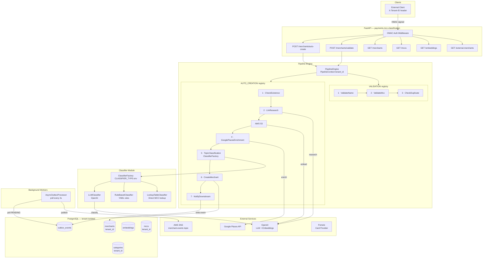
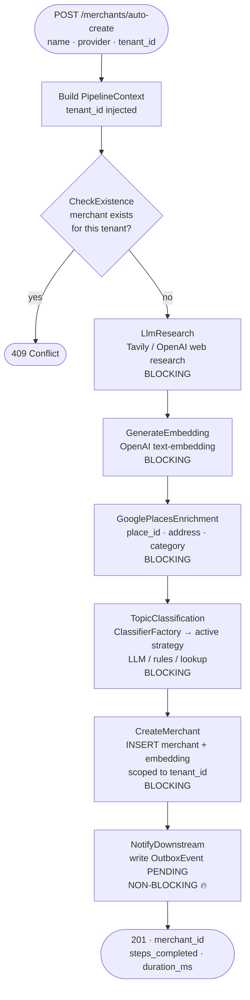
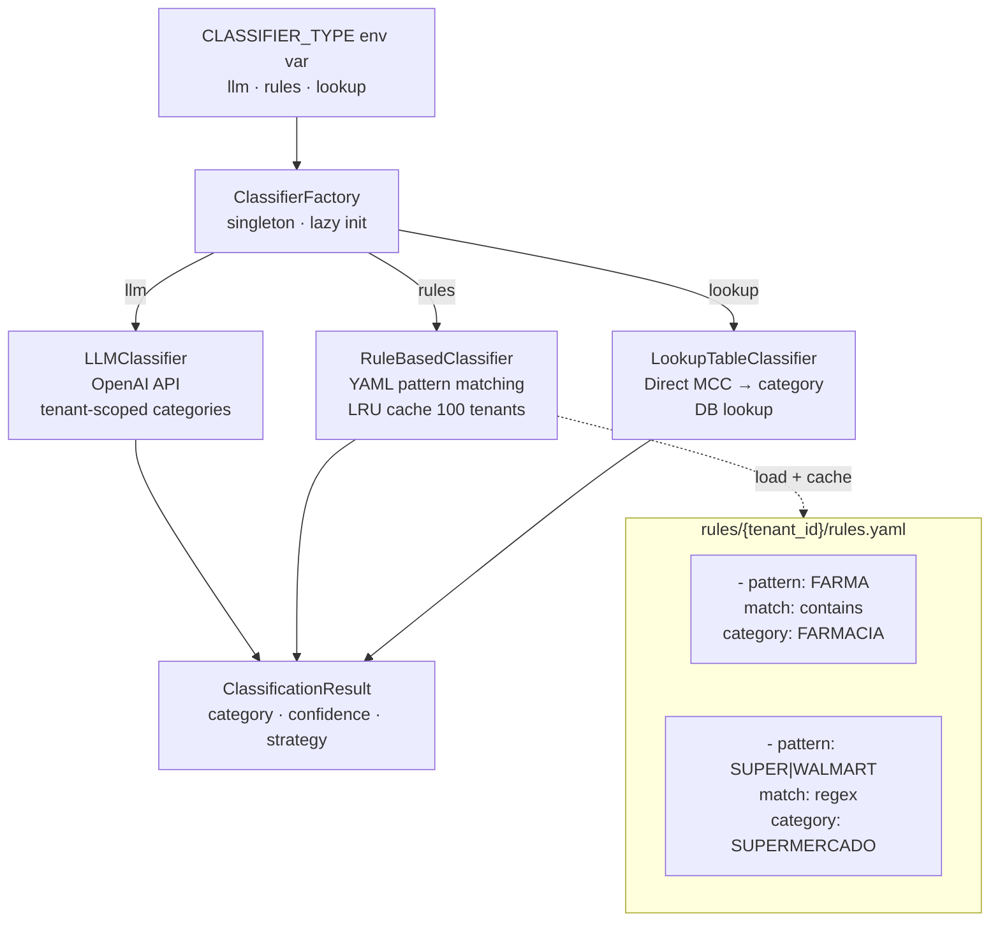
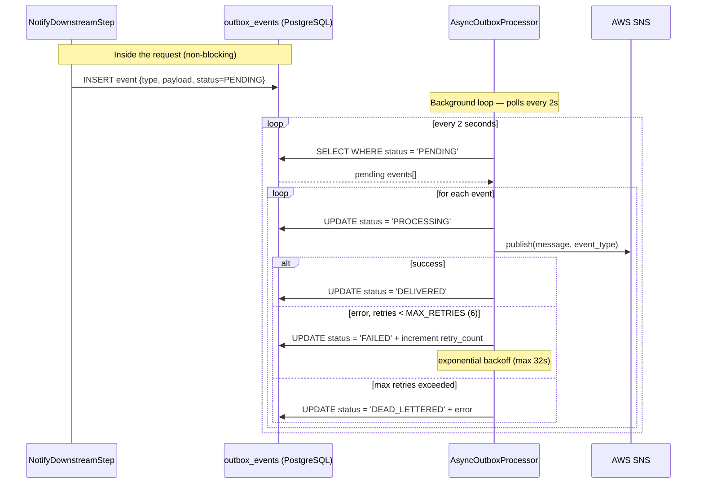

# payments-mcc-classification

A Python/FastAPI microservice for merchant management, embeddings, and AI-driven classification pipelines. Open source project by [syfra3](https://github.com/syfra3).

## Quick Start

### Prerequisites
- Python 3.11+
- PostgreSQL 16 with pgvector extension
- Poetry (Python package manager)
- Docker & Docker Compose (optional, for local development)

### Setup

1. Clone the repository and install dependencies:
```bash
cd payments-mcc-classification
poetry install
```

2. Copy and configure environment variables:
```bash
cp .env.example .env
# Edit .env with your configuration
```

3. Start PostgreSQL with Docker Compose:
```bash
docker-compose up -d postgres
```

4. Run migrations:
```bash
poetry run alembic upgrade head
```

5. Start the development server:
```bash
poetry run uvicorn app.main:app --reload --host 0.0.0.0 --port 8000
```

The API will be available at `http://localhost:8000`.

## Development Commands

See `Makefile` for all available commands:

```bash
make dev              # Start development server
make test             # Run tests
make test-cov         # Run tests with coverage
make lint             # Check code quality
make format           # Format code
make migrate          # Run database migrations
make docker-up        # Start all Docker services
```

## Architecture Overview

`payments-mcc-classification` is a configurable, open-source FastAPI microservice that any business can deploy to classify payments into custom topics or categories. When a payment network receives a transaction from an unknown merchant, it calls the `/merchants/auto-create` endpoint; the service runs a 7-step pipeline that researches the merchant, generates a vector embedding, enriches metadata from Google Places, classifies the merchant into a topic via a pluggable classifier (LLM, rule-based, or lookup-table), persists the record, and reliably notifies downstream systems via an outbox pattern backed by AWS SNS — all behind HMAC-signed inter-service authentication and with full tenant isolation so multiple businesses can share a single deployment with isolated data.

### System Architecture



The system diagram shows all major components and their relationships. Every inbound request carries an `X-Tenant-ID` header that flows through the `PipelineContext` into every repository query, ensuring that merchants, MCCs, and categories are fully isolated between tenants. Step 5 (`TopicClassification`) delegates to the `ClassifierFactory`, which selects the active classifier strategy at runtime via the `CLASSIFIER_TYPE` environment variable — no code changes are needed to switch between LLM, rule-based, or lookup-table classification.

### Auto-Creation Pipeline



The auto-creation pipeline processes each unknown merchant through seven sequential steps, any of which can short-circuit with an error response. The key step is `TopicClassification` (step 5), which replaced the former hardcoded `MccClassification` step: it asks the `ClassifierFactory` for the active strategy and calls `IClassifier.classify(merchant_name, tenant_id)`, returning a `ClassificationResult` with the matched category and confidence score. All database writes (step 6) are scoped to the `tenant_id` carried in the `PipelineContext`, preventing any cross-tenant data leakage.

### Classifier Strategy



The classifier module decouples the classification strategy from the pipeline through the `IClassifier` interface, allowing any business to switch strategies by setting a single environment variable. `LLMClassifier` wraps the existing OpenAI integration and queries tenant-scoped categories to build its prompt context. `RuleBasedClassifier` loads per-tenant YAML rule files from `CLASSIFIER_RULES_PATH/{tenant_id}/rules.yaml` and caches up to 100 tenants in an LRU cache for performance. `LookupTableClassifier` performs a direct database lookup for deployments that manage a curated MCC-to-category mapping themselves. All three return the same `ClassificationResult` dataclass, making them interchangeable without any changes to the pipeline or API layer.

### Outbox Pattern — Reliable Event Delivery



The outbox pattern guarantees at-least-once delivery of merchant creation events to downstream systems (AWS SNS) without coupling the HTTP response to the success of the publish call. Step 7 of the pipeline writes a `PENDING` event record to PostgreSQL inside the same database transaction as the merchant insert, so the event is never lost even if the process crashes immediately after. The `AsyncOutboxProcessor` background worker polls the `outbox_events` table every 2 seconds, attempts to publish each pending event to SNS, and transitions it to `DELIVERED` on success or `FAILED` with exponential backoff on error; after 6 retries the event is marked `DEAD_LETTERED` for manual inspection.

### Key Components

- **Pipeline Engine**: Step-based architecture with decorator-driven discovery
- **Transaction Management**: Context-var ambient sessions for request-scoped transactions
- **Provider Abstraction**: Pluggable LLM (OpenAI), Card (Pomelo), and Embedding providers
- **Embedding Search**: pgvector-based similarity search with configurable indexes
- **Outbox Pattern**: Reliable event delivery with retries and idempotency
- **HMAC Authentication**: Request signing for inter-service communication

## Project Structure

```
app/
├── api/v1/              # FastAPI routers
├── services/            # Business logic
├── pipeline/            # Engine + steps
├── providers/           # LLM, Card, Embedding, Storage
├── repositories/        # Data access layer
├── models/              # SQLAlchemy ORM models
├── core/                # Config, context, auth, exceptions
├── workers/             # Background jobs (Outbox processor)
└── schemas/             # Pydantic request/response schemas

tests/
├── unit/                # Unit tests
├── integration/         # Integration tests
└── e2e/                 # End-to-end tests

alembic/                 # Database migrations
```

## Configuration

### Environment Variables

See `.env.example` for all required and optional variables:

- `ENVIRONMENT`: development | staging | production
- `DATABASE_URL`: PostgreSQL async connection string (required)
- `OPENAI_API_KEY`: OpenAI API key (required)
- `LANGFUSE_PUBLIC_KEY`, `LANGFUSE_SECRET_KEY`: Optional, for tracing
- `POMELO_API_KEY`, `POMELO_BASE_URL`: Card provider integration
- `HMAC_SECRET`: Shared secret for request signing

### Database

PostgreSQL 16+ with pgvector extension. Migrations managed via Alembic.

```bash
# Create a new migration
poetry run alembic revision --autogenerate -m "description"

# Apply migrations
poetry run alembic upgrade head

# Revert one migration
poetry run alembic downgrade -1
```

## API Endpoints

### Merchants
- `POST /api/v1/merchants` - Create merchant
- `GET /api/v1/merchants` - List merchants
- `GET /api/v1/merchants/{id}` - Get merchant
- `PUT /api/v1/merchants/{id}` - Update merchant
- `DELETE /api/v1/merchants/{id}` - Delete merchant
- `POST /api/v1/merchants/search/similarity` - Vector similarity search
- `POST /api/v1/merchants/bulk/create` - Batch create
- `POST /api/v1/merchants/bulk/update` - Batch update

### MCCs
- `POST /api/v1/mccs` - Create MCC
- `GET /api/v1/mccs` - List MCCs
- `GET /api/v1/mccs/{id}` - Get MCC
- `PUT /api/v1/mccs/{id}` - Update MCC
- `POST /api/v1/mccs/search/similarity` - Vector similarity search

### Health
- `GET /health` - Health check
- `GET /health/ready` - Readiness check

## Testing

Run tests with pytest:

```bash
# All tests
poetry run pytest

# With coverage
poetry run pytest --cov=app --cov-report=html

# Specific test file
poetry run pytest tests/unit/test_models.py

# Specific test
poetry run pytest tests/unit/test_models.py::test_merchant_uppercase
```

## Production Deployment

1. Build Docker image:
```bash
docker build -t payments-mcc-classification:latest .
```

2. Set environment variables for production

3. Run migrations:
```bash
docker run --rm payments-mcc-classification alembic upgrade head
```

4. Start the application with uvicorn, gunicorn, or container orchestration

## Troubleshooting

### Connection refused
- Ensure PostgreSQL is running: `docker-compose ps`
- Check DATABASE_URL in .env

### pgvector extension not found
```bash
docker-compose exec postgres psql -U postgres -c "CREATE EXTENSION IF NOT EXISTS vector;"
```

### Import errors
```bash
poetry install --with dev
poetry run mypy .
```

## Contributing

1. Create a feature branch
2. Make changes and add tests
3. Run `make format` and `make lint`
4. Submit a pull request

## License

MIT
